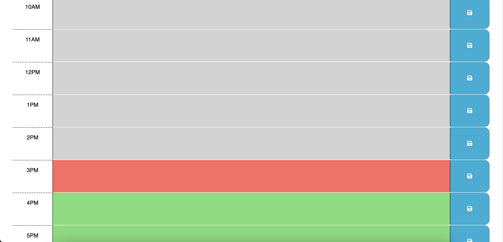

# Javascript To-Do List

## Description
A simple app made from starter code that helps the user track tasks that they have to do throughout the day.  It keeps track of the current hour and colors the seperate sections based on hours past, present, and future to help you stay on top of deadlines.  The app also locally saves your data so that your tasks stay when the page is re-opened or refreshed.  The app was made to practice utilizing dayjs in addition to jquery to handle the DOM manipulation.  

## Usage
Simply click on an hour section that you'd like to enter some tasks into and click the save button!  
Provide instructions and examples for use. Include screenshots as needed.

## Credits

Jquery and Dayjs were used in this project, as well as some starter code from the UW Madison Bootcamp [Repo](https://github.com/coding-boot-camp/crispy-octo-meme) for this module.

